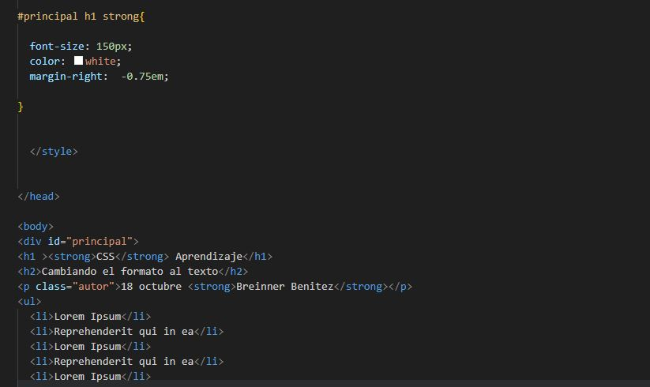

###  SELECTORES BASICOS  (PRACTICA3 formatotexto),  INGRESA AL LINK DE LA PARTE DE ABAJO PARA OBSERVAR 
[ CLICK AQUI PARA VISUALIZAR ](https://breinnerbenitez.github.io/Css-pracita-cascada/)
___

### 1 Parte del codigo en imagenes 

 

___

## 2 

___

